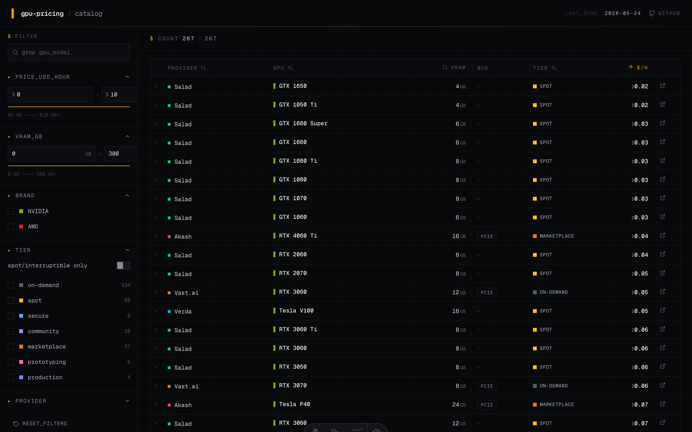

<div align="center">

# gpu-pricing

**Compare per-hour cloud GPU rental prices across 21 providers, in one searchable table.**

On-demand, spot, marketplace tiers — H100 down to GTX 1050 Ti. Single GPU only. No long-term commits, no serverless inference APIs, no "contact sales".

[](https://github.com/tardellirs/gpu-pricing/actions/workflows/ci.yml)
[](LICENSE)
[](https://astro.build)
[](https://vercel.com)
[](CONTRIBUTING.md)

[**Live site →**](https://gpu-pricing.vercel.app) · [Cost-benefit advice](https://gpu-pricing.vercel.app/advice) · [Contribute](CONTRIBUTING.md)

</div>

---

<p align="center">
  <picture>
    <source media="(prefers-color-scheme: dark)" srcset="docs/screenshot-dark.png">
    <source media="(prefers-color-scheme: light)" srcset="docs/screenshot-light.png">
    
  </picture>
</p>

## Why this exists

Picking a GPU is harder than it should be. Hyperscalers, GPU-native clouds, marketplaces, and decentralized networks all price the same H100 differently — and the public comparison sites either go stale, hide behind paywalls, or get sponsored. **This is the spreadsheet I wanted but couldn't find:** a small set of curated, verifiable rows, sortable and filterable, with a link to every source page and a `collected_at` timestamp so you know how fresh the number is.

The data lives in a single JSON file checked into the repo. Anyone can audit it, fork it, or open a PR to correct a price.

## Features

- 🔍 **Free-text search** across GPU model names
- 💰 **Price range slider** — find every H100 under $2/h in two clicks
- 🧠 **VRAM range filter** — 80GB-and-up workloads have one less thing to think about
- 🏷️ **Tier filter** — on-demand vs spot vs marketplace, mix and match
- 🏢 **Provider filter** — 21 providers, each with their own colored badge
- ⚡ **Spot-only toggle** — show me only the interruptible deals
- 🔗 **Shareable URLs** — every filter state serializes (`?q=H100&price-max=2&spot=1`)
- 🌓 **Light & dark mode** — system preference by default, toggleable, persisted, FOUC-free
- 📊 **310 offerings · 21 providers** — and every row links to its source
- ✅ **Schema-validated data** — `npm run validate` catches typos before they ship

## Live data summary

| | |
|---|---|
| **Providers tracked** | 21 |
| **Total offerings** | 310 |
| **GPU brands** | NVIDIA · AMD |
| **Tiers** | on-demand, spot, secure, community, marketplace, prototyping, production |
| **Cheapest H100 80GB (spot)** | Dataoorts Nova $0.79/h |
| **Cheapest A100 80GB (on-demand)** | Akash $1.08/h |
| **Cheapest RTX 4090** | Akash $0.17/h (marketplace) · Salad $0.25/h (interruptible, Medium tier) |
| **Last data snapshot** | 2026-05-24 |

For an opinionated breakdown of who to actually pick, see [`/advice`](https://gpu-pricing.vercel.app/advice).

## Providers covered

| Provider | Tiers | Notes |
|---|---|---|
| [RunPod](https://www.runpod.io/pricing) | community · secure · spot | Broadest catalog (31 SKUs) |
| [Salad](https://salad.com/pricing) | spot (Medium priority) | Consumer GPUs; vCPU/RAM billed separately |
| [Modal](https://modal.com/pricing) | on-demand (per-second) | Serverless |
| [Lambda](https://lambda.ai/pricing) | on-demand | No spot |
| [Genesis Cloud](https://www.genesiscloud.com/pricing) | on-demand | Consumer 1x only (HGX is 8x bundle) |
| [Hyperstack](https://www.hyperstack.cloud/gpu-pricing) | on-demand | No egress fees |
| [GPUHub](https://www.gpuhub.com/home) | on-demand | Singapore provider |
| [Novita](https://novita.ai/pricing) | on-demand · spot (~50% off) | |
| [Verda (ex-DataCrunch)](https://verda.com/products) | on-demand · spot (~65% off) | |
| [Dataoorts](https://dataoorts.com/pricing/) | on-demand · spot | 5 series (X-Series, Nova, Atlas, Orion, Yotta); vCPU/RAM free |
| [Spheron](https://www.spheron.network/pricing/) | marketplace | Cheapest live offer ≈ spot |
| [Packet.ai](https://packet.ai/) | on-demand | No spot, no cluster minimums |
| [Vultr](https://www.vultr.com/pricing/) | on-demand | 1x SKUs limited (HGX is 8x bundle) |
| [DigitalOcean](https://www.digitalocean.com/pricing/gpu-droplets) | on-demand | Includes egress |
| [Jarvis Labs](https://jarvislabs.ai/pricing) | on-demand · spot (~56% off, estimated) | |
| [Qubrid](https://platform.qubrid.com/pricing) | on-demand | |
| [Vast.ai](https://vast.ai/pricing) | on-demand · interruptible (~50% off) | Marketplace |
| [Akash](https://akash.network/pricing/gpus/) | marketplace | Decentralized (Cosmos blockchain) |
| [CoreWeave](https://www.coreweave.com/pricing) | on-demand (Classic 1x only) | |
| [TensorDock](https://www.tensordock.com/cloud-gpus.html) | on-demand | Page may be stale |
| [Thunder Compute](https://www.thundercompute.com/pricing) | prototyping · production | GPU-over-IP virtualization |

## Run locally

Requires Node 20+ (a `.nvmrc` is included).

```bash
git clone https://github.com/tardellirs/gpu-pricing.git
cd gpu-pricing
npm install
npm run dev
# open http://localhost:4321
```

Scripts:

| Command | What it does |
|---|---|
| `npm run dev` | Astro dev server with HMR |
| `npm run build` | Static production build to `dist/` |
| `npm run preview` | Serve the production build locally |
| `npm run validate` | Zod-validate `offerings.json` + `providers.json` |
| `npm run check` | `astro check` (TypeScript + Astro diagnostics) |

## Tech stack

- **[Astro 4](https://astro.build)** — static output, almost no JS on the wire
- **React 18** — hydrates only the table island (TanStack Table)
- **[Tailwind CSS](https://tailwindcss.com)** — with `rgb(var(--token) / <alpha>)` theme tokens for light/dark
- **[TanStack Table v8](https://tanstack.com/table)** — headless sort/filter
- **[Zod](https://zod.dev)** — single source of truth for data shape, runtime-validated in CI
- **[lucide-react](https://lucide.dev)** — icons
- **Geist Mono + Geist Sans** — typography

Hosting: **[Vercel](https://vercel.com)** (zero config, free tier).

## Contributing

Found a wrong price? Saw a new provider? Two routes:

1. **One-minute path:** open an issue with the [price-update template](.github/ISSUE_TEMPLATE/price-update.yml) or the [new-provider template](.github/ISSUE_TEMPLATE/new-provider.yml).
2. **Faster merge:** edit [`src/data/offerings.json`](src/data/offerings.json) directly, bump `collected_at` to today, run `npm run validate`, send a PR.

Full schema and rules of inclusion: [CONTRIBUTING.md](CONTRIBUTING.md).

The data file is intentionally small enough to comfortably edit in GitHub's web editor — no local setup required for a price correction.

## How the data was collected

This isn't scraped — every number was pulled manually from each provider's public pricing page on 2026-05-24, cross-checked across aggregators when the official page used JS-loaded tables we couldn't fetch. Caveats (separately-billed vCPU/RAM, marketplace volatility, stale pages, vendor-side bugs) are encoded as `caveats[]` on each row and surface in the row's expanded detail.

If your favorite provider isn't here, it's probably because:

- They only sell 8x+ bundles (we're 1x-only).
- They only do serverless inference APIs (we're VM/container rentals).
- Their pricing is "contact sales" only.
- We missed them — [tell us](https://github.com/tardellirs/gpu-pricing/issues/new?template=new-provider.yml).

## License

[MIT](LICENSE). Fork it, embed it, repurpose the data — just don't sue us if a price is wrong.

---

<div align="center">

Built because I needed it. Open-sourced because you might too.

</div>
